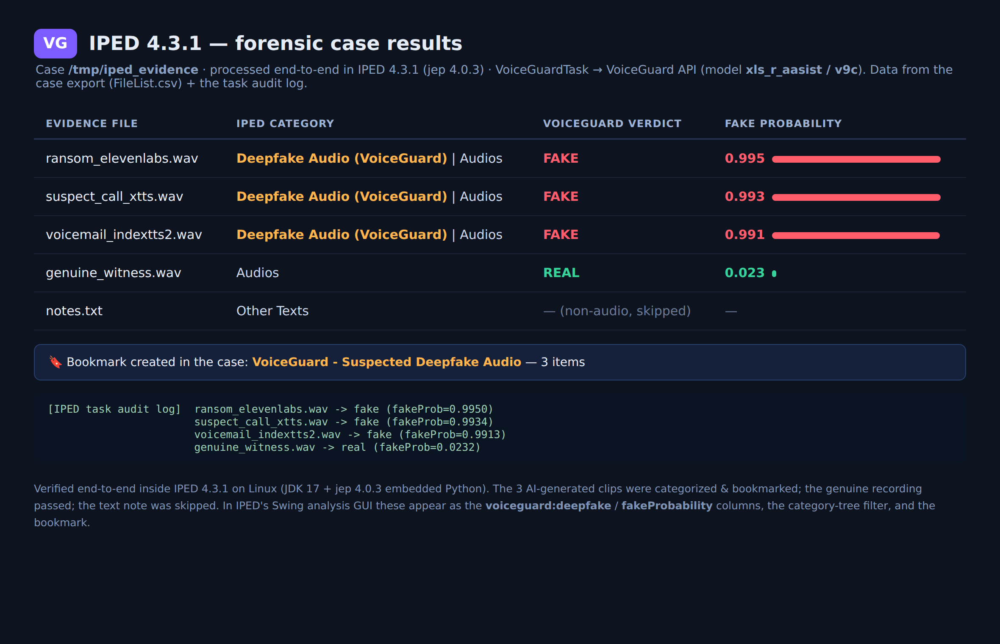

# VoiceGuard ↔ IPED integration

Adds **audio-deepfake detection** to [IPED](https://github.com/sepinf-inc/IPED)
(Indexador e Processador de Evidências Digitais — the Brazilian Federal Police's
open-source digital-forensics platform).

## Demo

[](iped_voiceguard_demo.mp4)

**▶ [Watch the 30-second demo](iped_voiceguard_demo.mp4)** — a screen capture of a real
IPED 4.3.1 case run: the `VoiceGuardTask` scores each audio item, the synthetic clip
lands in the **"Deepfake Audio (VoiceGuard)"** category and the **"VoiceGuard –
Suspected Deepfake Audio"** bookmark, while the genuine recording passes. *(Click to
play in GitHub's video viewer.)*

## Why this exists (VoiceGuard vs IPED)

This is **additive, not competitive**. IPED's built-in audio ML tasks
(`WhisperProcess`, `Wav2Vec2Process`) do **speech-to-text transcription**; its other
classifiers cover faces, age, and NSFW/CSAM imagery. **IPED has no audio-deepfake /
voice-spoofing detector.** This task fills that gap: during a normal IPED case run it
flags AI-generated / cloned voices (the VoiceGuard SSL detector — deployed model
**v9c**, official ASVspoof 2021 LA eval EER **2.84%**, catches Kokoro/XTTS/IndexTTS-2
and premium engines like ElevenLabs).

So the honest framing is *"VoiceGuard gives IPED a capability it doesn't have,"* not
*"VoiceGuard is better than IPED."*

## How it works

`VoiceGuardTask.py` is a standard IPED Python task. For each audio item it sends the
file to a running **VoiceGuard HTTP API** and records the verdict. It uses only the
Python standard library (`urllib`) — **no torch/CUDA inside IPED's jep threads**, so it
never competes with IPED (or any other GPU job) for the GPU. The VoiceGuard server
runs separately (same host is fine, including air-gapped) and holds the model.

```
IPED case run ──▶ VoiceGuardTask (per item, audio only) ──HTTP──▶ VoiceGuard /detect ──▶ SSL model (v9c)
                          │
                          ├─ column  voiceguard:deepfake        = real | fake
                          ├─ column  voiceguard:fakeProbability = 0.0–1.0  (sortable)
                          ├─ column  voiceguard:model           = detector id
                          ├─ category "Deepfake Audio (VoiceGuard)"  (when fake)
                          └─ bookmark "VoiceGuard - Suspected Deepfake Audio" (in finish())
```

## Install

1. **Run the VoiceGuard server** (the model backend), reachable from the IPED host:
   ```bash
   XLS_R_AASIST_PATH=/path/to/v9c/model_best.pt \
   PYTHONPATH=src uvicorn voiceguard.api.main:app --host 127.0.0.1 --port 8000
   ```
2. **Enable Python tasks in IPED** (once): `pip install jep` and put `jep.so` on
   `LD_LIBRARY_PATH` — see the [IPED Python-modules guide](https://github.com/sepinf-inc/IPED/wiki/User-Manual#python-modules).
3. **Drop in the task:** copy `VoiceGuardTask.py` to `<IPED>/scripts/tasks/`.
4. **Register it** in `<IPED>/conf/TaskInstaller.xml` (see `TaskInstaller-snippet.xml`):
   add `<task script="VoiceGuardTask.py"></task>` near the other script tasks.
5. **Configure** (optional — defaults target a local server) via environment variables
   before launching IPED:

   | env var | default | meaning |
   |---|---|---|
   | `VOICEGUARD_API` | `http://127.0.0.1:8000` | server base URL (auto-detects `/api`*) |
   | `VOICEGUARD_USER` / `VOICEGUARD_PASSWORD` | `admin` / `voiceguard2026` | API credentials |
   | `VOICEGUARD_TIMEOUT` | `30` | per-request timeout (s) |
   | `VOICEGUARD_IPED_ENABLED` | `true` | disable without removing the task |

6. Run IPED normally. Audio items get the columns/category above; open the
   **VoiceGuard - Suspected Deepfake Audio** bookmark to triage flagged voices.

   *\* `VOICEGUARD_API` may point at the bare API (`uvicorn voiceguard.api.main:app`,
   endpoints at `/token`) **or** the combined demo server (API under `/api`). The task
   tries the root first and falls back to `/api` automatically — both work.*

## Where the results appear (IPED's GUI)

IPED has a desktop **Analysis GUI** (Java/Swing) that the examiner opens on the
processed case. This task's outputs surface there with no extra UI work:
- **Columns** `voiceguard:deepfake` and `voiceguard:fakeProbability` (sortable) in the
  evidence table — sort by `fakeProbability` to rank the most-likely fakes first.
- **Category** *Deepfake Audio (VoiceGuard)* in the categories tree (one click to
  filter to all flagged audio).
- **Bookmark** *VoiceGuard - Suspected Deepfake Audio* under Bookmarks.
- Searchable in the query bar, e.g. `voiceguard:deepfake:fake`.

Processing is headless (CLI/`iped.exe`); these results are reviewed in the GUI after.

## Robustness (forensic-safe by design)

- `process()` **never raises** — any failure is recorded as `voiceguard:error` on the
  item and skipped, so a detector hiccup can't abort the evidence-processing job.
- Every HTTP call has a **timeout**; a hung server can't stall IPED threads.
- The JWT is **re-acquired on 401** (long cases outlive the token) and the request retried once.
- `getMediaType()` is null-guarded (falls back to file extension).

## Status — ✅ verified end-to-end in IPED 4.3.1


*Real results from the processed IPED case (the `FileList.csv` export + the task audit
log). The 3 AI-generated clips are categorized "Deepfake Audio (VoiceGuard)" and
bookmarked; the genuine recording passes; the text note is skipped.*

Run inside a real **IPED 4.3.1** install (Linux, JDK 17, jep 4.0.3 embedded Python)
against a test case of 4 audio files + 1 text note. IPED loaded `VoiceGuardTask.py`
via jep, processed each item, and produced — straight from the pipeline:

| evidence file | source engine | VoiceGuard verdict |
|---|---|---|
| `ransom_elevenlabs.wav` | ElevenLabs (premium) | **fake** (0.995) |
| `suspect_call_xtts.wav` | XTTS | **fake** (0.993) |
| `voicemail_indextts2.wav` | IndexTTS-2 | **fake** (0.991) |
| `genuine_witness.wav` | real human | real (0.023) |
| `notes.txt` | (non-audio) | skipped |

All audio classified correctly, the text note skipped, and the **3 fakes auto-bookmarked**
under *"VoiceGuard - Suspected Deepfake Audio"*. The full server model **v9c** (via the
API) was used, so even premium ElevenLabs was caught. Set `VOICEGUARD_IPED_LOG` to write
this per-item audit trail to a file.
